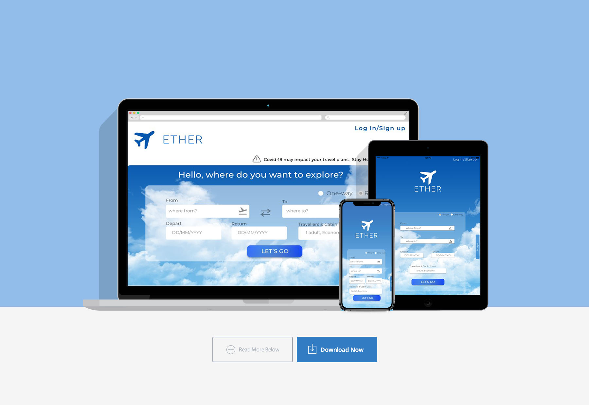
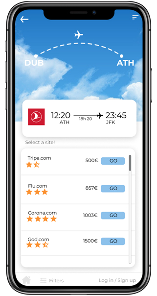
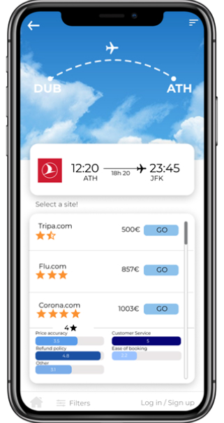
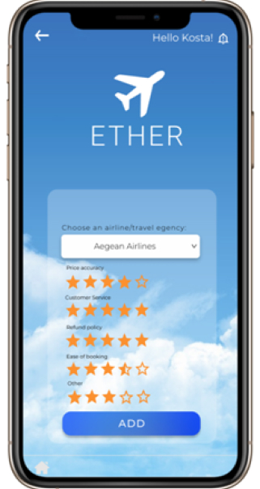
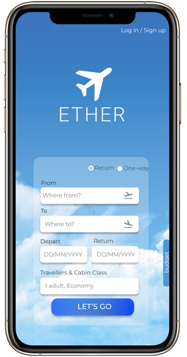

# SoftwareTechnology

  

Project for Software Engineering class. 
 
We designed a travel agency called ETHER.

 Project for Software Engineering class. 

 We designed a travel agency called ETHER. 

### Tools
 * Use case scenarios and diagram with StarUML
 * User stories with Gherkin 
 * Structure of APIs using Swagger Editor and wiring them together using Node-RED
 * UI Design with Figma 
 

  
  <dr>
  
  
  
  
  

